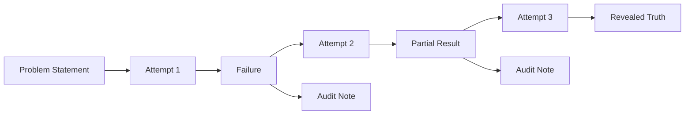

<div align="center">

# Marble Carver

**"I saw the angel in the marble and carved until I set him free."**
-- Michelangelo

*A structured toolkit for subtractive research.*

[](#)
[](#)
[](#)
[](#)

</div>

---

## Why?

Every hard problem -- a Clay millennium problem, a mysterious disease mechanism,
a fundamental question in physics -- has a truth buried inside it. The
researcher's job is not to *invent* from nothing, but to **remove everything
that isn't the truth**.

This project gives you the tools, templates, and discipline to do that
systematically, transparently, and beautifully.

### What makes this different?

| Principle | How marble-carver enforces it |
|-----------|-------------------------------|
| **Failures are valuable** | Every attempt is numbered, dated, and preserved. Dead ends become signposts for future researchers. |
| **Retractions preserve the original** | When you correct a claim, the original text stays. A dated audit note sits beside it -- visible forever. |
| **Auditability by design** | Every claim is traceable to a citation, a Lean proof, or an explicit assumption. |
| **Formal + empirical** | Mix Lean 4 proofs with mechanistic models in the same project. |
| **Solo -> team -> AI** | Works for a single researcher, a human+AI pair, or a multi-agent swarm. |

---

## Features

### Core (works with just Markdown + Git)
- Structured attempt templates with hypothesis / method / results / failures / next steps
- Visible audit / retraction notes (original claim stays forever)
- Verified references template (DOI/PMID focused)
- Problem statement + gap templates
- Git-native workflow (no lock-in)

### Optional Polished TUI (`pip install -e .[tui]`)
- **Main Dashboard** -- live stats: attempts, audits, Lean sorry count, progress visualization
- **New Attempt Wizard** -- guided flow that auto-fills the template
- **Attempt Browser** -- searchable, filterable history with live preview
- **Audit / Retraction Tool** -- easy dated corrections while preserving history
- **Verification Runner** -- one-click Lean build, citation check, custom scripts
- **Session Logger** -- "Start carving session" with timestamps and smart prompts
- Clean keyboard-driven interface (Textual + Rich)

### Repository Features
- GitHub Issue templates for attempts, audits, new problems
- Suggested GitHub Projects board layout (Marble Block -> Carving -> Removed -> Revealed)
- Two ready-to-use example projects
- Lean 4 + mathlib template ready for formal sections
- Beautiful, inspiring documentation

---

## Quick start

### 1. Use as GitHub template (no Python)

```bash
# Click "Use this template" on the GitHub repo page.
# Clone your new repo.
# Start carving in fundamental/your-problem/ or math/your-theorem/
```

### 2. Install with helper tools

```bash
git clone <url>
cd marble-carver
pip install -e .
python tools/audit_helper.py --list examples/ns_blowup_mini/carvings/
python tools/verify_citations.py --check examples/
```

### 3. Install with the TUI

```bash
pip install -e .[tui]
marble-carver tui
# or
python -m marble_carver
```

### 4. One-command setup

```bash
make setup
# or
./setup.sh
```

---

## Project structure

```
marble-carver/
├── templates/             # Markdown templates for the carving workflow
│   ├── attempt.md         #   A numbered carving attempt
│   ├── audit_note.md      #   A dated correction (original stays visible)
│   ├── verified_refs.md   #   Structured citations (PMID/DOI)
│   ├── problem_statement.md
│   └── gap.md
├── examples/              # Realistic example projects
│   ├── ns_blowup_mini/    #   Navier-Stokes blow-up criteria
│   └── t1dm_mechanism_mini/   #  Type 1 diabetes mechanism
├── tools/                 # Python helper scripts
│   ├── audit_helper.py
│   └── verify_citations.py
├── tui/                   # Optional Textual TUI application
│   ├── app.py
│   └── screens/
├── math/                  # Lean 4 carving projects
│   └── template/
├── mechanism/             # Medical/empirical carving projects
│   └── template/
├── fundamental/           # Physics/philosophy carving projects
│   └── template/
├── docs/                  # Documentation
│   ├── PHILOSOPHY.md
│   ├── GETTING_STARTED.md
│   └── WORKFLOW.md
└── .github/               # Issue templates, workflows, PR template
```

---

## Core workflow



## Who this is for

- Researchers working on Clay problems, open conjectures, or fundamental mechanisms
- Solo indie researchers and AI-augmented thinkers
- Teams that value radical transparency and retraction culture
- Anyone tired of accumulating notes and ready to start *removing* falsehood

---

## Tech stack

- **Python** + **Textual** (modern TUI, built on Rich)
- **Lean 4** + **mathlib** (formal math)
- **Markdown** + Git (core, zero-dependency experience)
- **hatchling** packaging (pyproject.toml)
- GitHub-native (Issues, Projects, Actions)

---

## License

MIT -- see [LICENSE](LICENSE).

---

## Contributing

See [CONTRIBUTING.md](CONTRIBUTING.md). We especially welcome:

- New templates for specific domains
- Improvements to the TUI
- Example projects that demonstrate beautiful carving
- Documentation that makes the philosophy even clearer

---

<div align="center">

*Start carving. The angel is already in there.*

</div>
