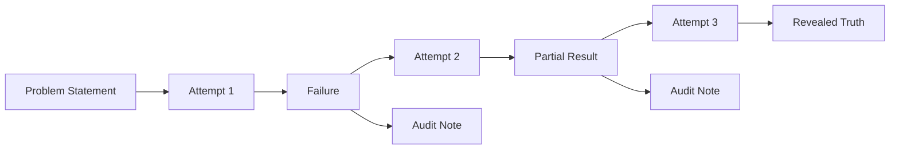

<div align="center">


# Marble Carver

**"I saw the angel in the marble and carved until I set him free."**
— Michelangelo

*A structured toolkit for subtractive research.*

[](#)
[](#)
[](#)
[](#)
[](#)
[](#)

</div>

---

## Why?

Every hard problem — a Clay millennium problem, a mysterious disease mechanism,
a fundamental question in physics — has a truth buried inside it. The
researcher's job is not to *invent* from nothing, but to **remove everything
that isn't the truth**.

This project gives you the tools, templates, and discipline to do that
systematically, transparently, and beautifully.

### What makes this different?

| Principle | How marble-carver enforces it |
|-----------|-------------------------------|
| **Failures are valuable** | Every attempt is numbered, dated, and preserved. Dead ends become signposts for future researchers. |
| **Retractions preserve the original** | When you correct a claim, the original text stays. A dated audit note sits beside it — visible forever. |
| **Auditability by design** | Every claim is traceable to a citation, a Lean proof, or an explicit assumption. |
| **Formal + empirical** | Mix Lean 4 proofs with mechanistic models in the same project. |
| **Solo → team → AI** | Works for a single researcher, a human+AI pair, or a multi-agent swarm. |

---

## Philosophy

> *Non ha l'ottimo artista alcun concetto*
> *ch'un marmo solo in sé non circoscriva*
> *col suo soverchio; e solo a quello arriva*
> *la man che ubbidisce all'intelletto.*
>
> — Michelangelo, Sonnet 151 (c. 1538–1544)

The dominant metaphor for research is **constructive**: we build theories, stack
experiments, assemble proofs. This has a hidden cost: it treats wrong turns as
waste, dead ends as shameful, and retractions as failures.

The carving metaphor flips this.

- The truth is already in the problem. Every false hypothesis you discard is **progress**.
- Every failed experiment narrows the space of what remains.
- Every retraction is a victory — you found something that didn't belong, and you removed it.

> "I have not failed. I've just found 10,000 ways that won't work."
> — widely attributed to Edison

Read the full philosophy at [`docs/PHILOSOPHY.md`](docs/PHILOSOPHY.md).

---

## Use cases

| If you're... | Start here |
|---|---|
| A solo researcher with a hard problem | Use the Markdown templates with Git — zero install |
| An AI-augmented thinker pairing with LLMs | Install tools + let your agent use `audit_helper.py` |
| A lab group valuing transparency | Use the full TUI with shared Git history |
| A formal mathematician writing Lean 4 proofs | Use `math/template/` with mathlib |
| A biomedical researcher mapping mechanisms | Use `mechanism/template/` |
| A philosopher or physicist exploring foundations | Use `fundamental/template/` |

---

## Features

### Core (works with just Markdown + Git)
- Structured attempt templates with hypothesis / method / results / failures / next steps
- Visible audit / retraction notes (original claim stays forever)
- Verified references template (DOI/PMID focused)
- Problem statement + gap templates
- Git-native workflow (no lock-in)

### Optional Polished TUI (`pip install -e .[tui]`)
- **Main Dashboard** — live stats: attempts, audits, Lean sorry count, progress visualization
- **New Attempt Wizard** — guided flow that auto-fills the template
- **Attempt Browser** — searchable, filterable history with live preview
- **Audit / Retraction Tool** — easy dated corrections while preserving history
- **Verification Runner** — one-click Lean build, citation check, custom scripts
- **Session Logger** — "Start carving session" with timestamps and smart prompts
- Clean keyboard-driven interface (Textual + Rich)

### Python CLI Tools
- `marble-carver init --template <type>` — scaffold a new project in seconds
- `marble-carver verify citations` — batch-check PMIDs and DOIs against NCBI / Crossref
- `marble-carver tui` — launch the full dashboard
- `python tools/audit_helper.py --add <attempt>` — auto-generate audit notes
- `python tools/verify_citations.py --check <dir>` — standalone citation verification

### Repository Features
- GitHub Issue templates for attempts, audits, new problems
- Suggested GitHub Projects board layout (Marble Block → Carving → Removed → Revealed)
- Two ready-to-use example projects
- Lean 4 + mathlib template ready for formal sections
- Beautiful, inspiring documentation

---

## Quick start

### Use as GitHub template (no Python)

```bash
# Click "Use this template" on the GitHub repo page.
# Clone your new repo.
# Start carving in fundamental/your-problem/ or math/your-theorem/
```

### Install with helper tools

```bash
git clone <url>
cd marble-carver
pip install -e .
python tools/audit_helper.py --list examples/ns_blowup_mini/carvings/
python tools/verify_citations.py --check examples/
```

### Install with the TUI

```bash
pip install -e .[tui]
marble-carver tui
# or
python -m marble_carver
```

### One-command setup

```bash
make setup
# or
./setup.sh
```

---

## Project structure

```
marble-carver/
├── templates/             # Markdown templates for the carving workflow
│   ├── attempt.md         #   A numbered carving attempt
│   ├── audit_note.md      #   A dated correction (original stays visible)
│   ├── verified_refs.md   #   Structured citations (PMID/DOI)
│   ├── problem_statement.md
│   └── gap.md
├── examples/              # Realistic example projects
│   ├── ns_blowup_mini/    #   Navier-Stokes blow-up criteria
│   └── t1dm_mechanism_mini/   #  Type 1 diabetes mechanism
├── tools/                 # Python helper scripts
│   ├── audit_helper.py
│   └── verify_citations.py
├── marble_carver/         # Python package (CLI entry point)
│   ├── cli.py
│   ├── __init__.py
│   └── __main__.py
├── tui/                   # Optional Textual TUI application
│   ├── app.py
│   └── screens/
├── math/                  # Lean 4 carving projects
│   └── template/
├── mechanism/             # Medical/empirical carving projects
│   └── template/
├── fundamental/           # Physics/philosophy carving projects
│   └── template/
├── docs/                  # Documentation
│   ├── PHILOSOPHY.md
│   ├── GETTING_STARTED.md
│   └── WORKFLOW.md
├── assets/                # Images and media
└── .github/               # Issue templates, workflows, PR template
```

---

## Core workflow



### The carving cycle

1. **Define the problem** — What is the raw marble? What truth do you believe is inside?
2. **Propose an attempt** — A falsifiable hypothesis and a method to test it.
3. **Execute & document** — Write results, failures, and next steps.
4. **Audit when wrong** — Don't edit the original. Write an audit note beside it.
5. **Repeat** — Every removed piece brings you closer to the angel.

---

## Who this is for

- Researchers working on Clay problems, open conjectures, or fundamental mechanisms
- Solo indie researchers and AI-augmented thinkers
- Teams that value radical transparency and retraction culture
- Anyone tired of accumulating notes and ready to start *removing* falsehood

---

## Real-world examples

| Example | Domain | What it demonstrates |
|---|---|---|
| [`examples/ns_blowup_mini/`](examples/ns_blowup_mini/) | PDEs / Clay problem | Hypothesis → failure → audit → refined hypothesis |
| [`examples/t1dm_mechanism_mini/`](examples/t1dm_mechanism_mini/) | Immunology / medicine | Sequence mimicry → structural mimicry → next steps |

---

## Tech stack

- **Python** + **Textual** (modern TUI, built on Rich)
- **Lean 4** + **mathlib** (formal math)
- **Markdown** + Git (core, zero-dependency experience)
- **hatchling** packaging (pyproject.toml)
- GitHub-native (Issues, Projects, Actions)

---

## Make targets

```text
make setup        Install everything (including TUI)
make install      Install core package only
make install-tui  Install with TUI
make tui          Launch the Textual TUI
make lint         Run ruff linter
make cite-check   Check citations in all markdown files
make verify       Run citation + Lean checks
make clean        Remove __pycache__ and build artifacts
```

---

## Contributing

See [CONTRIBUTING.md](CONTRIBUTING.md). We especially welcome:

- New templates for specific domains
- Improvements to the TUI
- Example projects that demonstrate beautiful carving
- Documentation that makes the philosophy even clearer

---

## License

MIT — see [LICENSE](LICENSE).

---

## Inspiration

> *"The best artist has no concept that a single marble block does not contain
> within itself — its excess removed; only the hand that obeys the intellect
> reaches that truth."*
>
> — Michelangelo, Sonnet 151

This project is named for the greatest carver who ever lived. Every file,
template, and tool is designed to help you find *your* angel.

---

<div align="center">

*Start carving. The angel is already in there.*

**Image**: Detail of Michelangelo's *David* (1501–1504). Photo by Jörg Bittner Unna, [CC BY-SA 3.0](https://creativecommons.org/licenses/by-sa/3.0/), via Wikimedia Commons.

</div>
